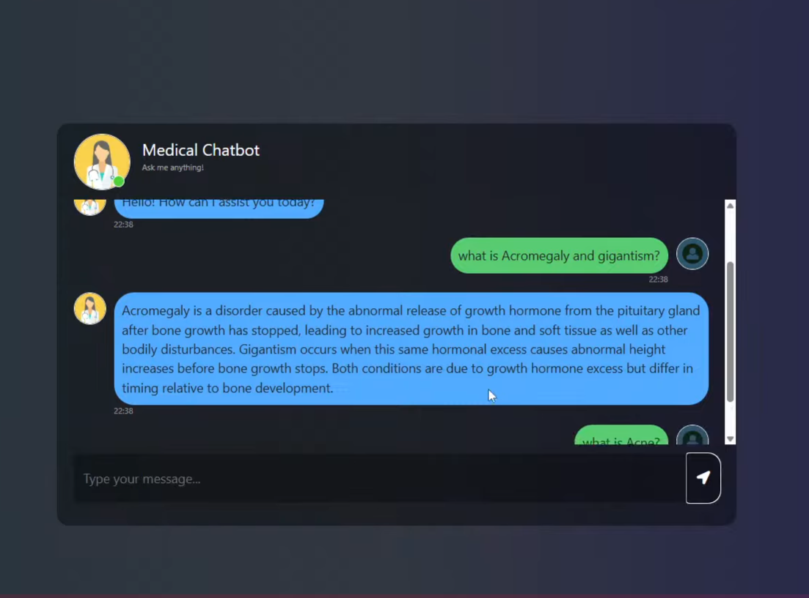

# 🛍️ Medical Chatbot 

## 📌 Overview

A Flask-based medical chatbot that uses Retrieval-Augmented Generation (RAG) to provide medical information and assistance. The chatbot leverages Pinecone for vector storage and Groq's LLM for generating responses
---

### Demo

## 🚀 Features

- **Medical Q&A:**: Get answers to medical questions using a RAG pipeline 
- **Vector Search**: Uses Pinecone for efficient similarity search  
- **Fast Inference**: Powered by Groq's high-speed LLM (Llama 3.3 70B)  
- **Web Interface**: Simple chat interface built with Flask templates 
- **Secure**: Environment variable configuration for API keys

---

## Tech Stack
- **Backend**: Flask
- **Vector Database**: Pinecone
- **LLM**: Groq (Llama 3.3 70B)
- **Embeddings**: Hugging Face embeddings
- **Language**: Python
- **Frontend**: HTML/CSS/JavaScript (via Flask templates)

---

